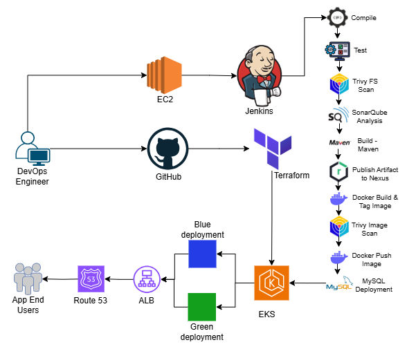

# Production-Level Blue-Green Deployment with Jenkins, SonarQube, Nexus, and AWS EKS

This project showcases how to implement a **Blue-Green Deployment strategy** in a production-style CI/CD pipeline. By combining **Jenkins, SonarQube, Nexus, Terraform, and AWS EKS**, we achieve **zero-downtime deployments** with seamless rollouts and easy rollbacks.

## 📌 Project Overview

* **Infrastructure**:

  * Four EC2 instances manually launched for:

    * Main Server
    * Jenkins
    * SonarQube
    * Nexus
  * Terraform (from GitHub) provisions the **EKS cluster** on AWS.

---

## ✨ Key Features

* **Zero Downtime** → Users stay connected even during deployments.
* **Blue-Green Rollouts** → Deploy to idle (Green) environment, then switch traffic from Blue.
* **Safe Rollbacks** → Roll back instantly by redirecting traffic back to Blue.
* **CI/CD Automation** → Jenkins handles build, test, and deployment pipelines.
* **Quality Gates** → SonarQube ensures only clean, maintainable code is deployed.
* **Artifact Management** → Nexus stores and versions all build outputs.

---

## 🛠️ Tools & Technologies

* **AWS EC2** → Servers for Jenkins, Nexus, SonarQube, and Main server
* **Terraform** → Infrastructure as Code for AWS EKS
* **AWS EKS (Kubernetes)** → Container orchestration for Blue/Green deployments
* **Jenkins** → CI/CD automation server
* **SonarQube** → Code quality and static analysis
* **Nexus** → Artifact repository manager
* **Route 53** → DNS management for custom domain mapping

---

## 🌐 Architecture

*(Add the architecture diagram PNG into the repo so it renders here)*

---

## 📖 Learn More

* 📝 [Medium Article](https://medium.com/p/61eeae3dda46) 

---

✅ With this pipeline, deployments are **automated, reliable, and rollback-ready**, ensuring continuous delivery without downtime.

---
